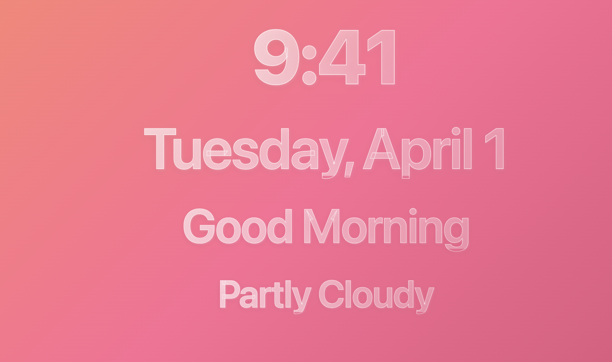
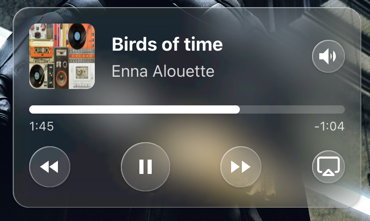
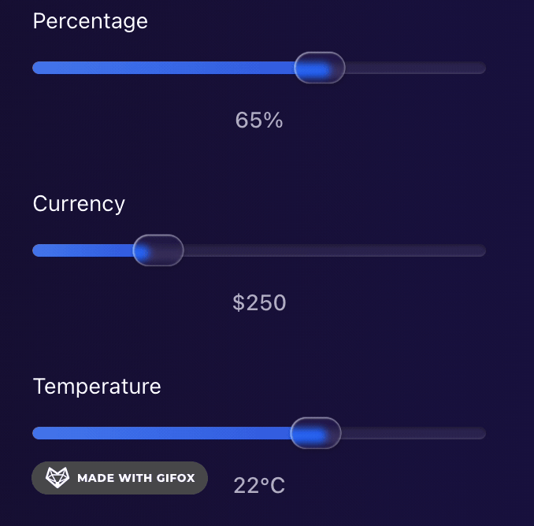
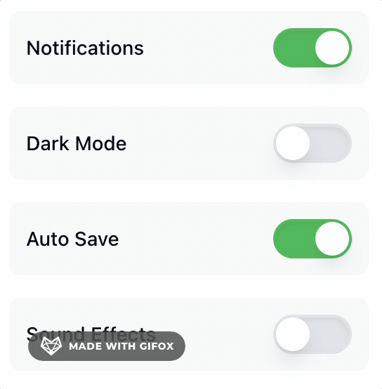

# React Liquid Glass UI

A modern React component library built with TypeScript, Tailwind CSS, Radix UI, and Storybook.

<p align="center">
  
</p>
<p align="center">
  
</p>
<p align="center">
  
</p>
<p align="center">
  
</p>

## Installation

```bash
npm install react-liquid-glass-ui
```

## Setup

**Important:** This package uses Tailwind CSS and requires the CSS to be imported for styles to work.

Import the compiled CSS file in your main application file:

```tsx
// In your main.tsx, App.tsx, or _app.tsx
import "react-liquid-glass-ui/dist/style.css";
```

## Usage

Go and check out the [Storybook](https://react-liquid-glass-ui.mtosity.com/) for usage examples.
